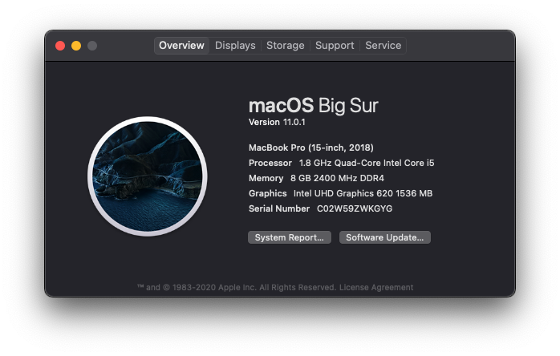
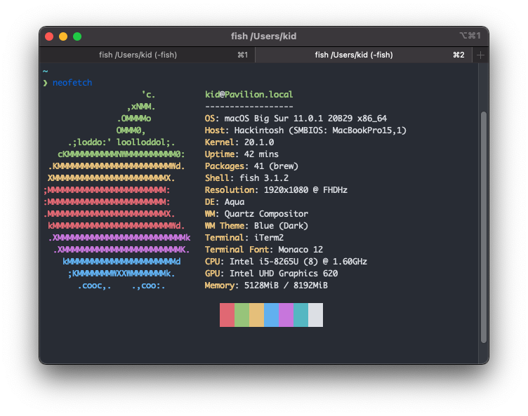
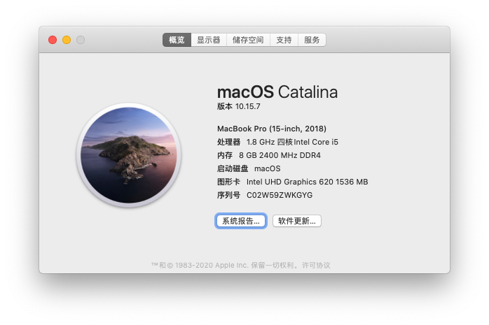
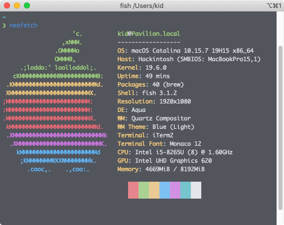

# 🍎 [HP Pavilion 13](https://support.hp.com/us-en/document/c06145752) Hackintosh

**READ THE NOTES BEFORE USING THE EFI**

## Status

OpenCore `0.6.3`, macOS `11.0.1`

- [x]  CPU, Memory and Disk
- Graphics
    - [x]  Basic
    - [x]  Hardware acceleration
- Wireless
    - [x]  Wi-Fi
    - [x]  Bluetooth
- Keyboard
    - [x]  Basic
    - [x]  Meta keys
    - [x]  Brightness keys
    - [x]  Backlight key
    - [x]  Volume keys
    - [x]  Media keys
- Touchpad
    - [x]  Basic
    - [x]  Gestures
- Power
    - [x]  Battery status
    - [x]  Sleep
    - [x]  Wake
    - [ ]  Hibernate (untested)
- Devices
    - [x]  Sound
    - [x]  Camera
    - [x]  Mic
- Ports
    - [x]  USB-A
    - [x]  USB-C
    - [ ]  HDMI
    - [ ]  Headphone Jack Combo (untested)
    - [ ]  Card reader (untested)
    - [ ]  ~~Fingerprint~~ (impossible)

## Screenshots

## Notes

- **Set `AppleXcpmCfgLock` to `true` if you haven't unlocked CFG Lock**.
- **Set `SecureBootModel` to `Disabled` when installing macOS 11.0**. If the installtion stuck on `AirportI`, you may need to force reboot.
- Default meta keys mapping:

  - Ctrl → Control
  - Win → Option
  - Alt → Command

  ---

  - Flip **Command** and **Option** keys for natural shortcuts.
  - Flip **Command** and **Control** keys for Windows shortcuts compatibility.

## Credits

- [Sound](https://github.com/insanelydeepak/cloverHDA-for-Mac-OS-Sierra-10.12/issues/27#issuecomment-318953631)
- [Battery](https://github.com/the-eric-kwok/HP-Pavillion-bc015tx-Hackintosh/blob/682a675d778ad03faae3984913871c7b3648410b/SSDT/SSDT-BatteryFix-bc015tx.dsl)
- [Unlock CFG Lock](https://zhuanlan.zhihu.com/p/121655468)

## See also

- http://bbs.pcbeta.com/forum.php?mod=viewthread&tid=1824403
- http://bbs.pcbeta.com/forum.php?mod=viewthread&tid=1856395
- http://bbs.pcbeta.com/forum.php?mod=viewthread&tid=1858446

## License

- Original content (such as [`SSDT-BATT`](Source/SSDT-BATT.dsl)): [MIT](https://opensource.org/licenses/MIT)
- Third-paty components (Bootloader, Kext, etc.) : Refer to the source of each component
