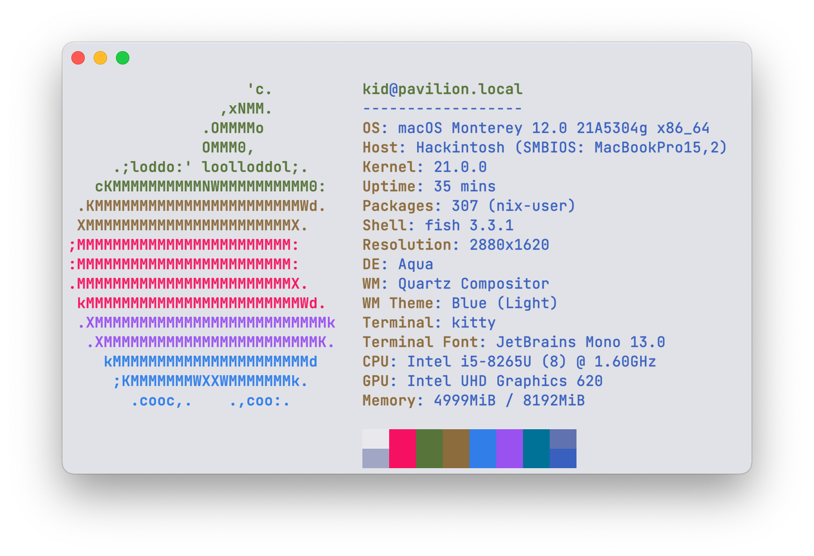

# 🍎 HP Pavilion 13 Hackintosh

**PLEASE READ THE [NOTES](#notes) FIRST**

This project tries to provide an open and working macOS setup for **HP Pavilion 13** laptop based on [OpenCore](https://github.com/acidanthera/OpenCorePkg), while achieving the following goals:

- Support as many features as we can
- Align with [`Sample.plist`](https://github.com/acidanthera/OpenCorePkg/blob/master/Docs/Sample.plist) as much as possible
- Use as little [`Quirks`](https://dortania.github.io/docs/release/Configuration.html#:~:text=Quirks%20provides%20support%20for%20specific%20workarounds.) as feasible

Note that this laptop comes in many variants, this EFI is created on the specs shown below, your miles may vary.

## Specs

- Device: [HP Pavilion 13-an0002tu](https://support.hp.com/us-en/document/c06145752)
- CPU: [i5-8265U](https://ark.intel.com/content/www/us/en/ark/products/149088/intel-core-i5-8265u-processor-6m-cache-up-to-3-90-ghz.html)
- Board: HP 84C5

## Status

OpenCore `0.8.7`, macOS `13.1 (22C65)`, BIOS `F.15`

- [x] Boot
- [x] GPU acceleration
- [x] Wi-Fi ([with minor issues)](https://github.com/OpenIntelWireless/itlwm/issues)
- [x] Bluetooth ([with minor issues](https://github.com/OpenIntelWireless/IntelBluetoothFirmware/issues))
- [x] Keyboard
- [x] Touchpad & gestures

  **Known issue**: _Tap to click_ may not work at boot or after waking up. Work around: restarting or waking again may help.

- [x] Battery status
- [x] Sleep/wake (generally stable)
- [ ] Hibernate (untested)
- [x] Sound
- [x] Camera
- [x] Mic
- [x] USB
- [x] HDMI (patch provided by [@samchan1995](https://github.com/samchan1995))
- [x] Headphone Jack Combo (reported by Matt Richardson)
- [ ] Card reader (untested, possibly broken)
- [ ] ~~Fingerprint~~ (impossible)

## Screenshots

## Notes

- **Set `AppleXcpmCfgLock` to `true` if CFG lock is not unlocked**.

  Note that certain actions such as performing security reset in BIOS will reset CFG lock.

- **Use your own `MLB`, `ROM`, `SystemSerialNumber` and `SystemUUID` values.**

## Anatomy

This section provides an exhaustive explanation of [`EFI/OC`](EFI/OC).

- `ACPI`
  - `SSDT-AWAC`: [fix system clock](https://dortania.github.io/Getting-Started-With-ACPI/Universal/awac.html) (created using [SSDTTime](https://github.com/corpnewt/SSDTTime))
  - `SSDT-BATT`: fix battery status
  - (TODO)

## Credits

- [Sound](https://github.com/insanelydeepak/cloverHDA-for-Mac-OS-Sierra-10.12/issues/27#issuecomment-318953631)
- [Battery](https://github.com/the-eric-kwok/HP-Pavillion-bc015tx-Hackintosh/blob/682a675d778ad03faae3984913871c7b3648410b/SSDT/SSDT-BatteryFix-bc015tx.dsl)
- [Unlock CFG Lock](https://zhuanlan.zhihu.com/p/121655468)

## See also

- http://bbs.pcbeta.com/forum.php?mod=viewthread&tid=1824403
- http://bbs.pcbeta.com/forum.php?mod=viewthread&tid=1856395
- http://bbs.pcbeta.com/forum.php?mod=viewthread&tid=1858446

## License

- Original content (such as [`SSDT-BATT`](Source/SSDT-BATT.dsl)): [MIT](https://opensource.org/licenses/MIT)
- Third-paty components (Bootloader, Kext, etc.): Refer to the source of each component
