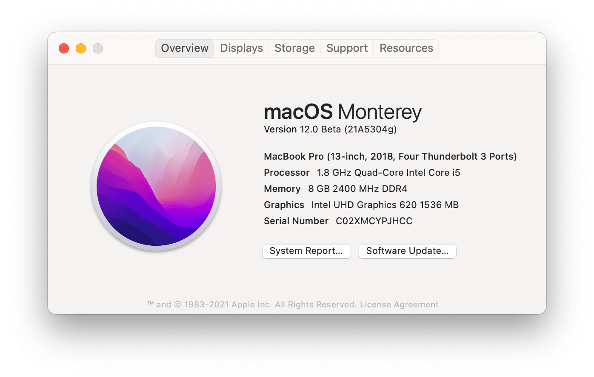

# 🍎 HP Pavilion 13 Hackintosh

**READ THE NOTES BEFORE USING THE EFI**

## Specs

- Device: [HP Pavilion 13-an0002tu](https://support.hp.com/us-en/document/c06145752)
- CPU: [i5-8265U](https://ark.intel.com/content/www/us/en/ark/products/149088/intel-core-i5-8265u-processor-6m-cache-up-to-3-90-ghz.html)
- Board: HP 84C5

## Status

OpenCore `0.6.7`, macOS `11.3 (20E5186d)`, BIOS `F.12`

- [x] CPU, Memory and Disk
  - CPUFriendDataProvider
    - LFM: `08`
    - EPP: `90`
    - Perf Bias: `05`
    - Additional Energy Savings Options: disabled
- Graphics
  - [x] Basic
  - [x] Hardware acceleration
- Wireless

  - [x] Wi-Fi
  - [x] Bluetooth

    Known issue: Bluetooth may randomly stop working. Disable and enable it again if this happens.

- Keyboard
  - [x] Basic
  - [x] Meta keys
  - [x] Brightness keys
  - [x] Backlight key
  - [x] Volume keys
  - [x] Media keys
- Touchpad
  - [x] Basic
  - [x] Gestures

    Known issue: Tap to click may randomly stop working at boot. Restarting or going to sleep and wake again may resolve the problem.

    This is said to be [fixed in VoodooRMI 1.3](https://github.com/VoodooSMBus/VoodooRMI/releases/tag/1.3), unfortunately it isn't.

- Power
  - [x] Battery status
  - [x] Sleep
  - [x] Wake
  - [ ] Hibernate (untested)
- Devices
  - [x] Sound
    - [x] [Boot-chime](https://dortania.github.io/OpenCore-Post-Install/cosmetic/gui.html#setting-up-boot-chime-with-audiodxe)
  - [x] Camera
  - [x] Mic
- Ports
  - [x] USB-A
  - [x] USB-C
  - [ ] HDMI
  - [ ] Headphone Jack Combo (untested, possibly broken)
  - [ ] Card reader (untested, possibly broken)
  - [ ] ~~Fingerprint~~ (impossible)

## Screenshots

## Notes

- **Set `AppleXcpmCfgLock` to `true` if you haven't unlocked CFG Lock**.
- **Use your own `PlatformInfo` values (`Serial`, `ROM`, etc.)**.
- **Set `SecureBootModel` to `Disabled` when installing macOS 11**. If the installtion stuck on `AirportI`, you may need to force reboot.
- Default meta keys mapping:

  - Ctrl → Control
  - Win → Command
  - Alt → Option

  Flip **Command** and **Control** keys for Windows shortcuts compatibility.

## Credits

- [Sound](https://github.com/insanelydeepak/cloverHDA-for-Mac-OS-Sierra-10.12/issues/27#issuecomment-318953631)
- [Battery](https://github.com/the-eric-kwok/HP-Pavillion-bc015tx-Hackintosh/blob/682a675d778ad03faae3984913871c7b3648410b/SSDT/SSDT-BatteryFix-bc015tx.dsl)
- [Unlock CFG Lock](https://zhuanlan.zhihu.com/p/121655468)

## See also

- http://bbs.pcbeta.com/forum.php?mod=viewthread&tid=1824403
- http://bbs.pcbeta.com/forum.php?mod=viewthread&tid=1856395
- http://bbs.pcbeta.com/forum.php?mod=viewthread&tid=1858446

## License

- Original content (such as [`SSDT-BATT`](Source/SSDT-BATT.dsl)): [MIT](https://opensource.org/licenses/MIT)
- Third-paty components (Bootloader, Kext, etc.) : Refer to the source of each component
